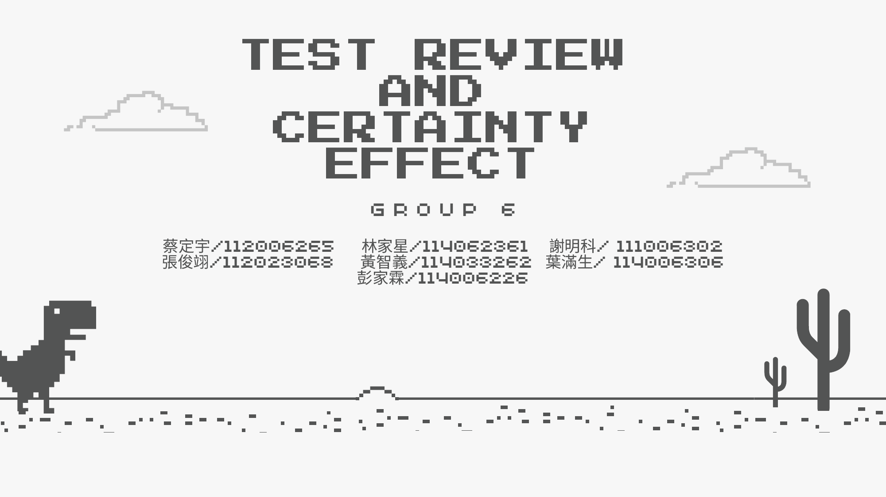

# Test Review & Certainty Effect

> A class presentation exploring choices, demographics, risk aversion, and the certainty effect.

<p align="center"></p>

## Overview

This group presentation organizes a classroom activity into three parts: **philosophy**, **demographics**, and **risk aversion**. It compares responses to choice-based questions, summarizes class demographics, and uses paired monetary-risk questions to discuss risk-averse, neutral, and risk-taking behavior.

**Context:** Group academic project at National Tsing Hua University.

## What the project covers

- Choice-based philosophy prompts
- Class demographic breakdowns
- Risk-aversion questions and response trends
- Interpretation of certainty/safety versus higher-risk choices

## Preserved artifact

- [`docs/test-review-certainty-effect.pdf`](docs/test-review-certainty-effect.pdf) — preserved copy of `5_Test Review and Certainty Effect.pdf`

## Repository structure

```text
.
├── README.md
├── ORIGINAL_FILE_MANIFEST.tsv
├── PUBLICATION_NOTES.md
├── docs/
├── assets/
```

## Preservation

The academic source file(s) in this repository were copied **without editing their contents**. `ORIGINAL_FILE_MANIFEST.tsv` records SHA-256 hashes so the preserved copies can be checked against the uploaded originals. The preview image, when present, is a derived convenience asset only.

## Public sharing

See [`PUBLICATION_NOTES.md`](PUBLICATION_NOTES.md) before publishing.
